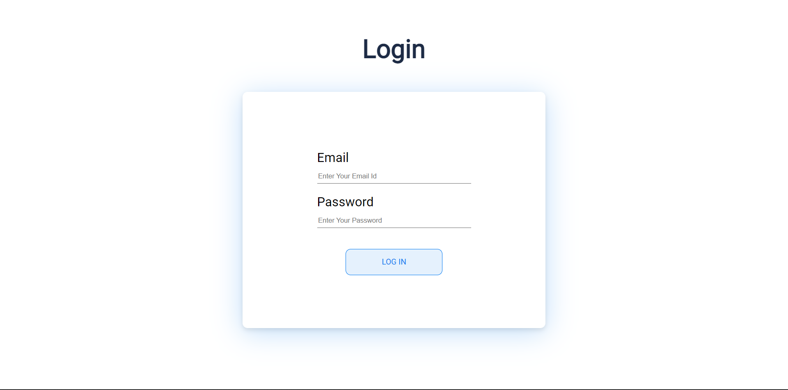
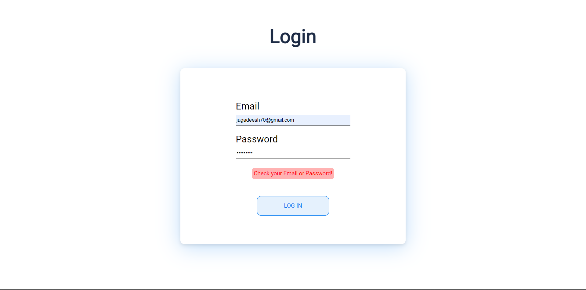
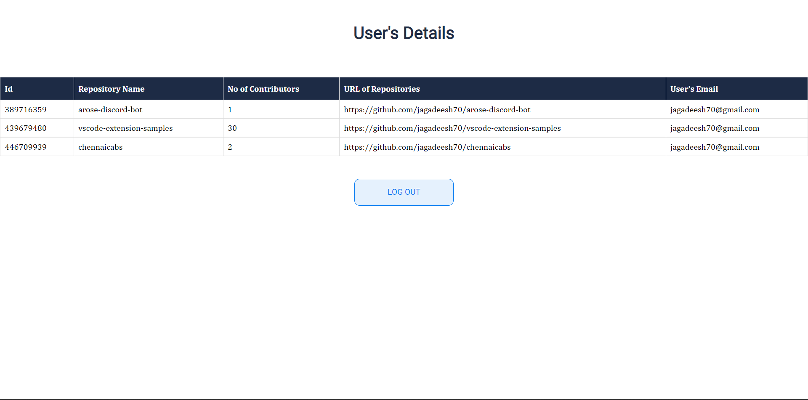

# Git Repo App

Use github username in login page to get your repositories.

## Tech Stack

### Frontend
- [React](https://reactjs.org/)

### Backend
- [NestJS](https://nestjs.com/)
- [TypeORM](https://typeorm.io/)
- [MySQL](https://www.mysql.com/)

### CRON
- [NodeJS](https://nodejs.org/)
- [Cron](https://www.npmjs.com/package/node-cron) - cron command-line utility is a job scheduler on Unix-like operating systems. Users who set up and maintain software environments use cron to schedule jobs, also known as cron jobs, to run periodically at fixed times, dates, or intervals.


## Start Redis

```bash
    # start redis
    sudo service redis-server start
```
## Start NestJs Server
```
# install packages
cd server && npm install
# start server
npm start or npm run start:dev in development
```

## Start Cron
```
# install packages
cd cron && npm install
# start cron
npm start
```

## Start Frontend
```
# install packages
cd client && npm install
# start server
npm start
```

## How to test
Install [Postman](https://www.getpostman.com/)
## API endpoints

HTTP route prefix : http://localhost:3000/

### API endpoints summary

### Login

Route      | Method | Description
-----------|--------|--------------------
/login     | post    | to get access token

### Repo

Route      | Method | Description
-----------|--------|--------------------
/repositories  | GET    | read repo (Authentication needed)

##### HTTP Request Body Example
```json
{
    "EMAIL" : "****@gmail.com",
    "PASSWORD" : "****"
}
In place of **** => give ur respective email and password
```
##### HTTP Response Body Example
```json
{
    "access_token" : "**************************************************************************"
}
```
##### TOKEN 
 BEARER TOKEN in authorization header
##### HTTP Request Body Example
Repo details will be fetched after logging in
##### HTTP Response Body Example
```json
{
    [
        {
        "id": your_repository_id,
        "username": "your_username",
        "repository_name": "repository_name",
        "repository_url": "https://api.github.com/users/****-****/repos",
        "email": "your_emailId"
        }
    ]
}
```
# SCREENSHOTS

## Login page


## Login page if invalid credential are entered



## DASHBOARD PAGE

## System Architecture


